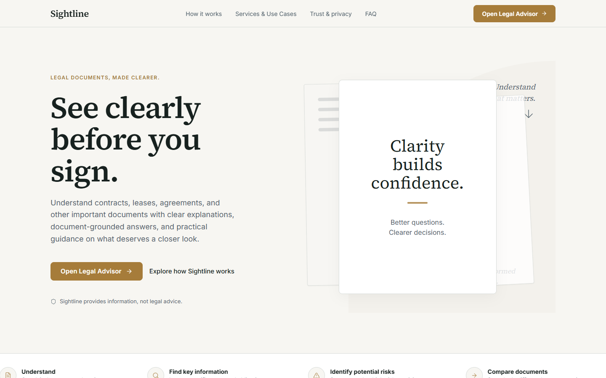
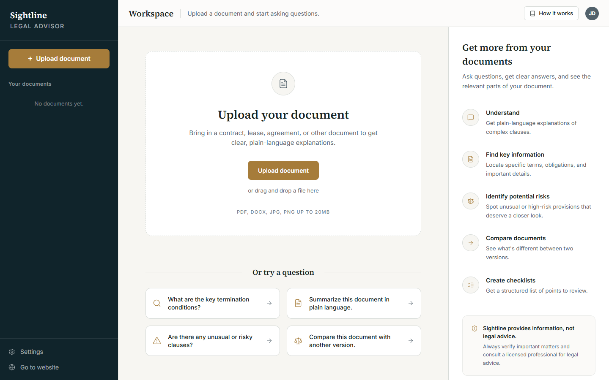

<div align="center">

# Sightline

### See clearly before you sign.

AI-powered legal document intelligence for understanding, exploring, comparing, and reviewing complex documents.

[Live Demo](https://sightline-chi-liart.vercel.app/) • [Open Legal Advisor](https://sightline-chi-liart.vercel.app/workspace)


</div>

## Live Demo
🚀 **Try Sightline:** [https://sightline-chi-liart.vercel.app/](https://sightline-chi-liart.vercel.app/)

⚖️ **Legal Advisor:** [https://sightline-chi-liart.vercel.app/workspace](https://sightline-chi-liart.vercel.app/workspace)

<div align="center">


*Document-first legal intelligence designed to turn complex documents into clear, actionable understanding.*

</div>

## What is Sightline?
Sightline is an AI-powered legal document intelligence platform designed to make complex legal documents easier to understand and review. Users can upload documents, explore important clauses, identify obligations and potential areas of concern, compare documents, ask document-grounded questions, and prepare information for professional legal review.

Core interaction:
**DOCUMENT → QUESTION → EVIDENCE → EXPLANATION → DECISION**

## Why Sightline?
Legal documents can contain dense terminology, obligations, deadlines, payment terms, restrictions, renewal conditions, termination provisions, cross-references, and potential inconsistencies. 

Sightline turns these challenging texts into an interactive document-centered experience, bridging the gap between raw legal text and clear comprehension.

## Core Capabilities

| Capability | Description |
|---|---|
| **Document Intelligence** | Builds a structured understanding of uploaded documents |
| **Understand** | Explains documents in plain language |
| **Key Information** | Extracts important dates, parties, amounts, and terms |
| **Clause Explorer** | Surfaces meaningful clauses and explanations |
| **Obligations & Responsibilities** | Identifies responsibilities and conditions |
| **Risk / Potential Concern Review** | Highlights areas that may deserve review |
| **Inconsistency Detection** | Finds potential conflicts within documents |
| **Document-Grounded Legal Advisor** | Answers document-grounded questions |
| **Document Summary** | Creates concise document summaries |
| **Action Checklist** | Converts document findings into review items |
| **Document Comparison** | Compares two documents |
| **Legal Professional Review Preparation** | Helps prepare questions for professional review |

## How It Works

```text
UPLOAD
   ↓
EXTRACT
   ↓
OCR IF NEEDED
   ↓
ANALYZE
   ↓
ASK
   ↓
EVIDENCE
   ↓
EXPLAIN
   ↓
REVIEW
```

## Product Preview

### Legal Advisor
Document-centered workspace for interacting with uploaded documents.


## Document Processing
Sightline relies on a robust hybrid client-server document processing pipeline.

**For text PDFs:**
`PDF → PDF text extraction → page-aware text → analysis → evidence → AI response`

**For scanned PDFs:**
`PDF → limited/no extracted text → OCR → page-aware OCR text → analysis → evidence → AI response`

*Note: OCR may contain recognition errors.*

## AI & Grounding
Sightline uses OpenRouter to communicate with the configured AI model (current default model: `google/gemini-2.5-flash`).

Document-specific answers are strictly grounded in extracted/OCR document content. The system carefully distinguishes:
**DOCUMENT-GROUNDED ANSWERS** from **GENERAL INFORMATION**.

The AI should not fabricate clauses, evidence, page numbers, quotations, dates, or risks. If a document does not contain a requested fact, Sightline should report that the information was not found rather than inventing an answer.

## Architecture

```text
      User
       │
       ▼
 Next.js / React
       │
 ┌─────┴───────┐
 ▼             ▼
Document      Chat
Processing    API
 │             │
 ├── PDF       │
 ├── OCR       ▼
 │         OpenRouter
 ▼             │
Document       ▼
Intelligence  Gemini
 │             │
 ▼             ▼
Evidence / Analysis
 │             │
 └─────┬───────┘
       ▼
Sightline Workspace
```

## Technology Stack

| Domain | Technologies |
|---|---|
| **Frontend** | Next.js, React, TypeScript, Tailwind CSS |
| **AI** | OpenRouter, Gemini 2.5 Flash |
| **Documents** | PDF text extraction (pdf.js), Tesseract.js OCR |
| **Markdown** | react-markdown, remark-gfm |
| **Export** | jsPDF |
| **Deployment** | Vercel |

## Security & Privacy
- **Security:** OpenRouter API key remains strictly server-side. No API key is exposed in the frontend. Environment variables are managed securely. File size and OCR limits are enforced. The system implements safe Markdown rendering and structured AI output validation. No unnecessary full-document logging occurs.
- **Privacy:** Document text extraction and OCR (when needed) is performed locally via client-side libraries. Only extracted text is sent securely to the AI for analysis.

## Accessibility
Sightline implements key accessibility practices:
- Semantic controls
- Keyboard accessibility
- ARIA labels
- Focus states
- Responsive layout
- Readable contrast
- Reduced-motion considerations

## Performance
- Analysis is performed once and reused
- OCR is processed sequentially
- Server-side AI calls
- Efficient client state management

## Setup

```bash
git clone https://github.com/indraaaa29/Sightline.git
cd Sightline
npm install
npm run dev
```
Then visit: [http://localhost:3000](http://localhost:3000)

## Environment Variables
Create a `.env.local` locally based on `.env.example`:

```env
OPENROUTER_API_KEY=your_api_key_here
OPENROUTER_MODEL=google/gemini-2.5-flash
```

*NEVER commit `.env.local`. NEVER put the real API key in README.*

## Testing
The application has been verified for:
- Production build
- PDF extraction
- Scanned PDF OCR
- Document-grounded questions
- Markdown rendering
- Document switching
- Comparison
- Checklist
- Risk review
- Accessibility
- Production deployment

## Limitations
- OCR may contain recognition errors.
- AI-generated explanations may contain errors.
- Important legal decisions should be reviewed with a qualified legal professional.
- Sightline provides information and document understanding, not legal advice.

## Challenge Alignment
Sightline addresses the challenge of accessible legal information by delivering practical document understanding, contextual AI assistance, and dynamic reasoning through real document processing, OCR, comparison, and review preparation in a highly usable document-first interface.

## Legal Disclaimer
Sightline provides information and document understanding, not legal advice. AI-generated explanations may contain errors and should not replace advice from a qualified legal professional.

## Repository Structure
```text
Sightline/
├── src/
├── public/
├── docs/
│   └── screenshots/
├── .env.example
├── .gitignore
├── package.json
├── package-lock.json
└── README.md
```

## Built By
Indranil Paul
GitHub: [https://github.com/indraaaa29](https://github.com/indraaaa29)
Project: Sightline
Live: [https://sightline-chi-liart.vercel.app/](https://sightline-chi-liart.vercel.app/)
